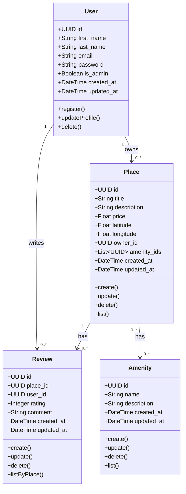

# 🏡 HBnB Evolution

HBnB Evolution es una aplicación web inspirada en AirBnB, diseñada para permitir a los usuarios registrar, buscar y gestionar propiedades, así como publicar reseñas y administrar amenidades.

---

## 🚀 Características Principales

- 📊 Visualización de entidades con **Mermaid.js**.
- 📡 **API RESTful** documentada y estructurada.

---

## 🧠 Arquitectura

- **Flask**
- **Mermaid.js**

---

## 📊 Diagrama Entidad-Relación

---

## 👤 Autor
- **Emanuel Rosa Alamo** - Estudiante de Holberton School