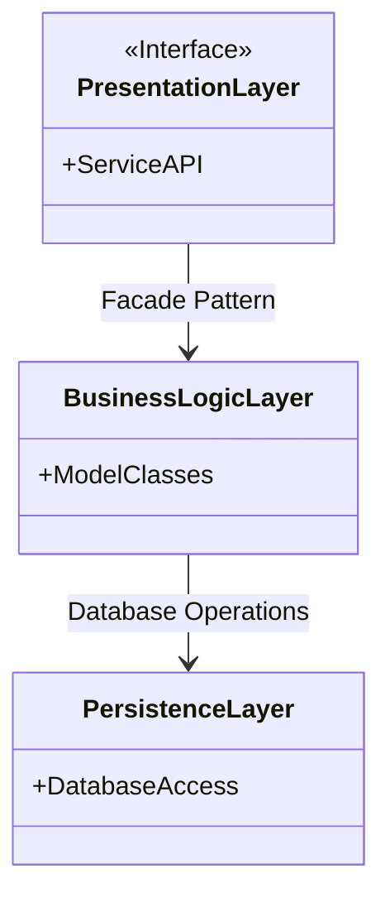
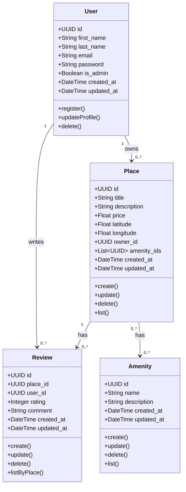
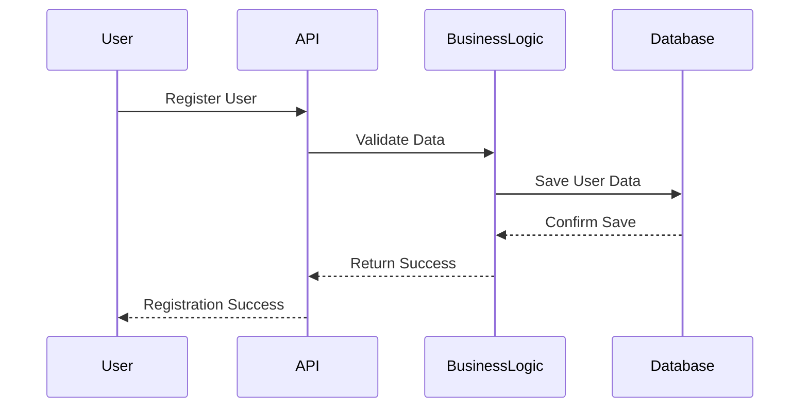
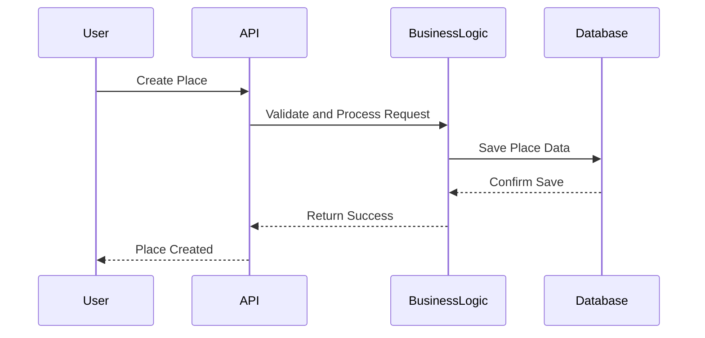
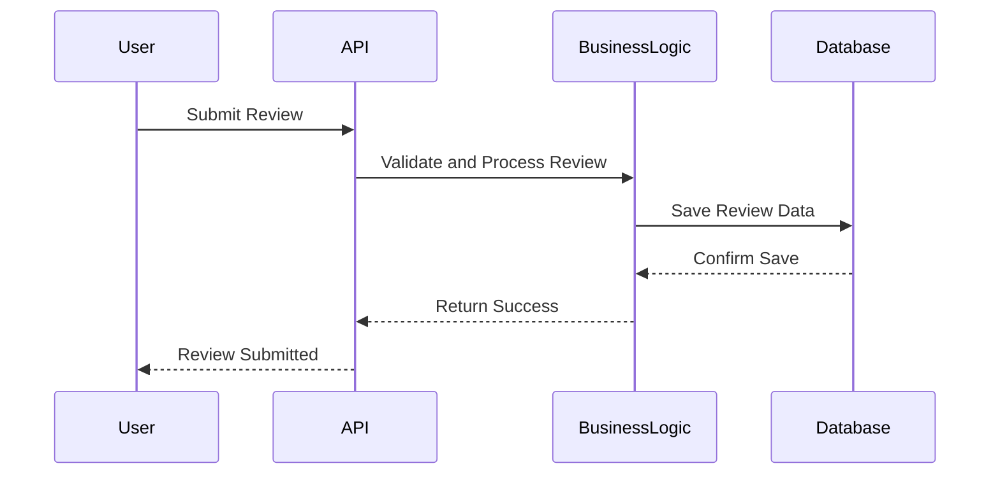
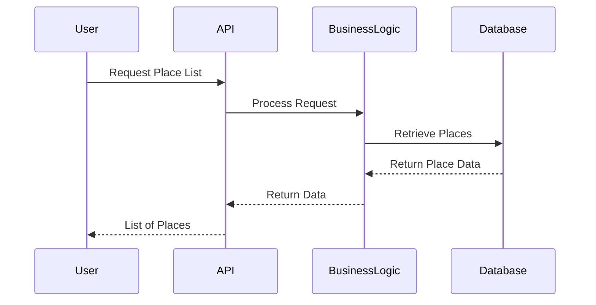

# **HBnB Evolution - Technical Documentation**

## **Introduction**

This document provides a comprehensive technical overview of the HBnB Evolution project. HBnB is a simplified version of an AirBbB-like application that allows users to manage listings, submit reviews, and manage amenities . This document outlines the system’s architecture, detailed class design, and sequence diagrams of various API interactions.

**Purpose:** The purpose of this document is to guide the implementation of the HBnB application by providing a clear and detailed blueprint for its architecture and business
logic.

**This document includes:**
- General architecture diagrams.
- Business logic details.
- Sequence diagrams for API flows.

**Scope:**
- **User Management:** Registration, profile updates, and user deletion.
- **Place Management:** Listing places, updating, and deleting properties.
- **Review Management:** Submitting and managing reviews for places.
- **Amenity Management:** Managing amenities associated with places.

---

## **High-Level Architecture**

### **High-Level Package Diagram**

### **Explanation of the Architecture**
1. **Presentation Layer**:
    - Handles user interactions and API endpoints.
    - Exposes services for user actions such as registration, place creation, review submission, and fetching data.
2. **Business Logic Layer:**:
    - Contains the core business logic and models representing entities like User, Place, Review, and Amenity.
3. **Persistence Layer:**:
    - Responsible for database operations, data storage, and retrieval.

**Facade Pattern:** The facade pattern simplifies interactions between layers by providing a unified interface through which the Presentation Layer communicates with the Business Logic Layer.

---

## **Business Logic Layer**

### **Class Diagram**

### **Explanation of the Class Diagram**
- **User:** Manages user data, registration, profile updates, and deletion.
- **Place:** Handles property listings, updates, deletions, and associations with amenities.
- **Review:** Manages reviews for places, including creation, updates, and deletions.
- **Amenity:** Manages amenities and their association with places.

---

## **API Interaction Flow**

### **Sequence Diagrams for API Calls**

#### **User Registration:** Ensures data validation before storing user information.

#### **Place Creation:** Validates and stores new place data.

#### **Review Submission:** Handles review creation and ensures it is associated with the correct place and user.

#### **Fetching a List of Places:** Retrieves and returns a list of places based on user criteria.

---

## **Conclusion**
This document provides a detailed overview of the architecture and design of the HBnB Evolution project, serving as a key reference for its implementation. The layered structure ensures scalability and maintainability, while detailed diagrams facilitate understanding of the interactions between components.
